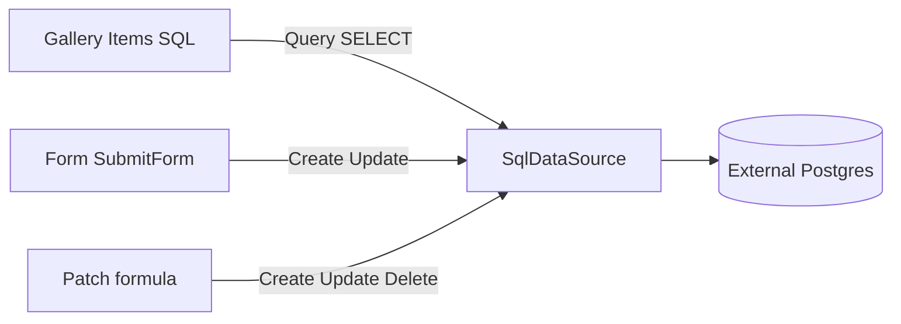

# Phase 7.16 — SQL write CRUD

## Why this next

MVP create → publish → open → interact is done. Remaining gaps that still hurt **interact** (not Marketplace/AI):

| Candidate | Leverage | Size |
|-----------|----------|------|
| **SQL write CRUD + Form/Patch** | Highest — galleries already list Postgres rows; Create/Update/Delete still stubbed | M–L |
| Storage upload/delete | Completes 7.11 read-only storage | M |
| Richer Filter/LookUp | Deepens 7.15; not a hard blocker | M |
| Artifact GC (8.2) | Ops polish; little end-user interact win | S–M |
| OAuth auth-code | Expands connectors, large security surface | L |

**Default: ship 7.16 SQL writes.** Entities + REST already mutate; SQL is the incomplete half of the connector story ([`docs/sql-connectors.md`](docs/sql-connectors.md) still lists “Write CRUD” as out of scope).

Today [`SqlDataSource.Create/Update/Delete`](services/runtime/internal/databinding/sql_datasource.go) return “not supported in phase 7.6”. [`formula/dispatcher.execPatch`](services/runtime/internal/formula/dispatcher.go) already routes through `DataSources.ForKind` — implementing SQL writes unlocks **Patch** immediately. Forms still call `records.Create/Update` only ([`form/service.go`](services/runtime/internal/form/service.go) ~189–211) and must branch on binding kind.

---

## Scope

**In**

- Implement `Create` / `Update` / `Delete` on `SqlDataSource` for **table-bound** connectors (`auth_config.table` + `primary_key` required).
- Safe dynamic SQL only: quoted identifiers via existing [`QuoteSQLTable` / `QuoteSQLIdent`](services/runtime/internal/databinding/sql_identifiers.go); bind values as `$n` parameters (no string-concatenated values).
- Wire **Form submit** to `SqlDataSource` when resolved datasource kind is `sql` (skip entity schema validation; light column allowlist = keys present in payload that pass `QuoteSQLIdent`).
- Confirm **Patch** / Remove paths hit the new methods (already registry-based).
- Docs + `validate-phase-7.16.mjs` + mark COMPLETE in [`instructions.md`](instructions.md).

**Out of scope**

- Named-query connectors (`list` SELECT override) remain **read-only** (no write through free-form SQL text).
- Non-UUID primary keys (keep UUID PK to match existing `Get` / `DataSource` APIs that take `uuid.UUID`).
- Optimistic concurrency / version columns on SQL tables.
- Storage upload/delete, OAuth auth-code, Marketplace/AI, full Power Fx, Workflow Manager stub.
- Studio redesign beyond a short “writes supported when table + PK set” note if UX already exists.

---

## Implementation

1. **SqlDataSource writes** ([`sql_datasource.go`](services/runtime/internal/databinding/sql_datasource.go))
   - `Create`: `INSERT INTO … (cols) VALUES ($…) RETURNING *` (or SELECT after insert).
   - `Update`: `UPDATE … SET … WHERE pk = $1` (ignore entity `version` arg).
   - `Delete`: `DELETE FROM … WHERE pk = $1`.
   - Reject if table or primary_key empty; reject invalid column names via `QuoteSQLIdent`.
   - Unit tests with fake DB / sqlmock-style as used elsewhere in package.

2. **Form submit path** ([`form/service.go`](services/runtime/internal/form/service.go))
   - On submit, if `resolver` reports `DataSourceKindSql`, call `sources.ForKind(sql).Create/Update` with `DataSourceKey{EntityID: connectorID}` instead of `records.*`.
   - Keep entity path unchanged for `DataSourceKindEntity`.
   - Adjust validation: skip `records.Validate*` for SQL; still require non-empty payload.

3. **Docs / tracking**
   - Update [`docs/sql-connectors.md`](docs/sql-connectors.md): remove write CRUD from out of scope; document UUID PK + table requirement.
   - Add Phase 7.16 row + validator run line in [`instructions.md`](instructions.md); set Next focus to storage writes or Filter deepen (whichever you pick after).

4. **Validator** `infrastructure/scripts/validate-phase-7.16.mjs`
   - Prefer Go unit tests for INSERT/UPDATE/DELETE + form/Patch compile path (live external Postgres optional).
   - Assert stubs no longer return “phase 7.6” errors in unit coverage.

---

## Exit criteria

- Gallery on a SQL connector can list rows; Form new/edit submit persists to that table; Patch formula updates a row; Delete removes a row.
- Named-query-only SQL connectors still refuse writes with a clear error.
- `go test` for `databinding` + `form` + `formula` passes; validator script green.

---

## After 7.16 (backlog, not this PR)

1. Storage upload/delete (complete 7.11 interact)
2. Thin richer Filter (`And`/`Or` equals or SQL `WHERE` pushdown)
3. 8.2 artifact GC on unpublish
4. OAuth auth-code / Marketplace / AI (explicitly later)
