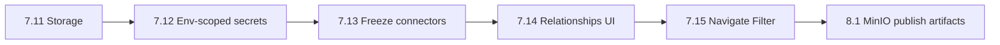

# Next work after Phase 7.11

**7.0–7.11** and **8.0 (ALM APIs + Studio)** are complete. [`instructions.md`](instructions.md) Next focus is platform polish / MinIO publish artifacts / env-scoped secrets.

**Default order (product-first):** correctness of environments and published apps before artifact offload and Marketplace.

---

## 1. Immediate — Phase 7.12 Env-scoped secrets

**Why:** Environments + promote already ship, but connectors still use one app-level secret. Dev/test/prod cannot differ safely.

**Ship:**

- Extend secrets (or connector binding) so a connector can resolve credentials per `environment_id` (fallback to app-default when unset).
- Studio: on Environments or Connector detail, set/override secret for an environment (write-only, same AES-GCM pattern as [`connector_secrets.go`](services/metadata/internal/services/connector_secrets.go)).
- Runtime: when package/session carries `environmentId`, decrypt the env override if present.
- Docs + `validate-phase-7.12.mjs`.

**Out of scope:** Vault, KMS rotation UI, changing promote semantics.

**Exit:** Promote to `test` with a different DSN/API key than draft; Open Runtime with `?environmentId=` uses the env secret.

---

## 2. Then — Phase 7.13 Snapshot-freeze connectors

**Why:** Published channel still reads live connector rows — draft connector edits can break released apps ([`docs/rest-connectors.md`](docs/rest-connectors.md)).

**Ship:** Include connector + action config (secret **refs**, not plaintext) in publish snapshot; published/`environmentId` runtime resolve from snapshot; draft channel stays live.

**Exit:** Edit a published app’s connector in Studio; published Open Runtime still uses frozen config until republish.

---

## 3. Then — Phase 7.14 Entity relationships UI

**Why:** Loudest Studio stub — [`TablePropertyView.tsx`](apps/studio/src/components/manager/database/TablePropertyView.tsx) “Relationships coming soon”.

**Ship:** Minimal many-to-one / lookup field UX on entities (metadata model + manager UI). No full graph designer.

---

## 4. Then — Phase 7.15 Navigate + Filter (usable Power Fx)

**Why:** Multi-screen apps and filtered galleries are day-to-day builder needs. Client Navigate exists; Go host still stubs nav; Filter/`equals` coverage is thin.

**Ship:** Wire Navigate on runtime host; Filter (or gallery filter props) for entity/connector lists with docs. Full Power Fx parity stays later.

---

## 5. Infra follow-on — Phase 8.1 MinIO publish artifacts

**Why:** Named in Next focus; `packages` table exists but unused; snapshots stay in Postgres JSON.

**Ship:** On publish, upload snapshot blob to MinIO; store URL/hash on package/version; runtime load path prefers artifact when present. Keep DB snapshot as fallback for one release.

---

## Explicitly later

| Item | Notes |
|------|--------|
| Storage upload/delete / presign | 7.11 is list/get only |
| SQL write CRUD + `$name` params | 7.9 is SELECT list only |
| OAuth auth-code / SharePoint | 7.10 is client_credentials only |
| Marketplace / AI | Deferred in MVP goal |
| Full Power Fx parity | Beyond 7.15 thin slice |

---

## Recommended first implementation PR

**Phase 7.12 only** — env-scoped connector secrets end-to-end (metadata + Studio + runtime resolve + validator). Highest leverage on ALM you already shipped.