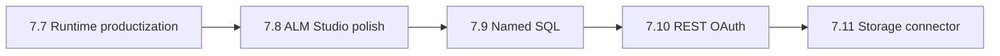

# Next work after Phase 7.7

**7.0–7.7** and **8.0 (ALM APIs)** are complete. `[instructions.md](instructions.md)` already points next at **7.8**.

---

## 1. Immediate — Phase 7.8 ALM Studio polish

**Why first:** Backend is done (`rollback` / `deprecate` / `listVersions` / `unpublish`). Studio only exposes **Unpublish** on `[AppCard.tsx](apps/studio/src/components/manager/apps/AppCard.tsx)`. `[publish-api.ts](apps/studio/src/api/publish-api.ts)` already has `rollback` + `deprecate` unused by UI.

**Ship:**

| Piece            | Approach                                                                                                                                                                                                                          |
| ---------------- | --------------------------------------------------------------------------------------------------------------------------------------------------------------------------------------------------------------------------------- |
| Versions surface | New **Versions** panel/modal per app (Apps manager or AppCard “Versions” action). Reuse `listVersions` pattern from `[PromoteEnvironmentModal.tsx](apps/studio/src/components/manager/environments/PromoteEnvironmentModal.tsx)`. |
| Rollback         | On a `released` version that is not current → confirm → `publishApi.rollback`. Refresh app status / version label.                                                                                                                |
| Deprecate        | On a version → confirm → `publishApi.deprecate`. If it was current, app becomes draft (match API rules). Disable or hide actions on already-deprecated rows.                                                                      |
| Unpublish        | Keep on AppCard (already shipped).                                                                                                                                                                                                |
| Docs + validate  | Mark **7.8 COMPLETE** in `instructions.md`; short note in `[docs/enterprise-alm.md](docs/enterprise-alm.md)`; `validate-phase-7.8.mjs` smoke (API + optional Studio check).                                                       |

**Out of scope for 7.8:** MinIO package artifacts, env-scoped secrets, snapshot-frozen connectors, new ALM APIs.

**Exit criteria:** From Studio, an operator can list versions, roll back to a prior released version, and deprecate a version without using raw API calls.

---

## 2. Then — connector productization (7.9 → 7.11)

| Slice                      | Focus                                                    | Starting point                                                                                                            |
| -------------------------- | -------------------------------------------------------- | ------------------------------------------------------------------------------------------------------------------------- |
| **7.9 Named SQL**          | Named / parameterized queries beyond table binding       | `[docs/sql-connectors.md](docs/sql-connectors.md)` (currently out of scope); extend `SqlDataSource` + Studio connector UX |
| **7.10 REST OAuth**        | OAuth client credentials / auth-code for REST connectors | Secrets + static headers done; OAuth deferred in REST docs                                                                |
| **7.11 Storage connector** | MinIO/S3-backed storage DataSource                       | Type already reserved in connector allowlist; no Studio create path or runtime loader yet                                 |

Do these only after 7.8 unless product priority shifts.

---

## 3. Explicitly later (not next)

- MinIO publish package store
- Env-scoped / Vault secrets
- Snapshot-freeze connectors into published packages
- Thin scaffolds (`services/environment`, `audit`, `connector`) becoming real services
- Relationships UI, Marketplace, AI, deeper Power Fx parity

---

## Recommended first implementation PR

**Phase 7.8 only** — versions UI + rollback/deprecate wiring + docs/validator. Smallest high-value gap: ALM APIs usable end-to-end from Studio.
