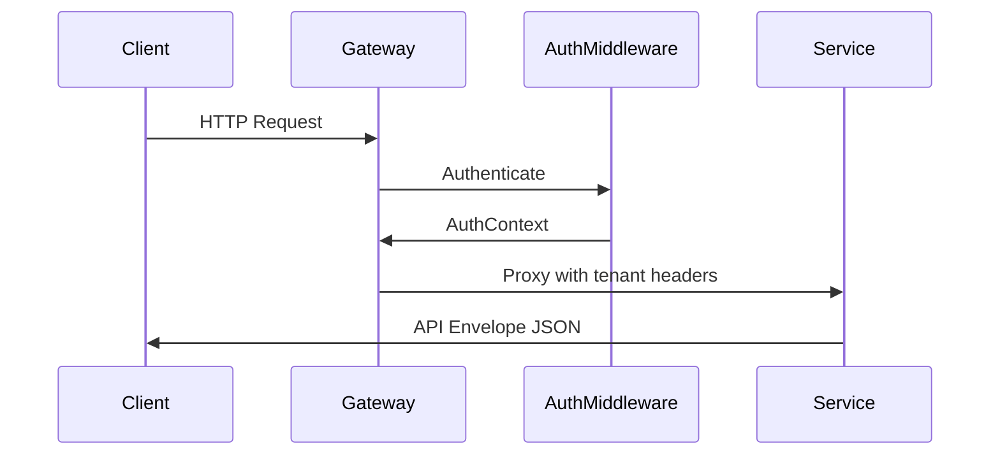

# GoApps Platform Architecture

## Overview

GoApps Platform is a cloud-native low-code platform built as a monorepo. Builders design apps in Studio; metadata is published as immutable snapshots; the Runtime kernel executes sessions against entity records and (progressively) connectors.

## Monorepo Layout

```
platform/
├── apps/           Frontend apps (studio, runtime)
├── services/       Go microservices (Fiber)
├── packages/       Shared libraries (Go + TypeScript)
├── infrastructure/ Docker, Kubernetes, scripts
└── docs/           Documentation
```

## Service Boundaries

| Service | Responsibility | Maturity |
|---------|----------------|----------|
| auth | Authentication and authorization (Keycloak integration) | Scaffold + gateway auth middleware |
| metadata | App definitions, screens, controls, entities, publish snapshots | Production path for Studio |
| runtime | Session kernel, formulas, gallery/form, records, renderer | Production path for Runtime |
| connector | External system integrations | Scaffold (REST execution lives in runtime V1) |
| publish | App publishing and versioning + ALM (unpublish/rollback/deprecate), proxies metadata | Production path (Phase 8.0) |
| environment | Environment config and secrets references (metadata is source of truth for env CRUD/promote) | Scaffold |
| audit | Audit trail recording (metadata is source of truth; writes hooked into ALM ops) | Scaffold |
| search | Search indexing and queries | Scaffold |
| gateway | Edge proxy + AuthContext | Development + Keycloak mode |

Each service is an independent Go module with its own deployment unit, health endpoints, and configuration.

## Shared Contracts

### API Response Envelope

All services return a consistent JSON envelope:

```json
{
  "success": true,
  "data": {},
  "error": null,
  "meta": { "requestId": "uuid", "timestamp": "ISO-8601", "pagination": { "limit": 50, "offset": 0, "total": 100 } }
}
```

Error responses set `success: false`, `data: null`, and populate `error` with `code`, `message`, optional `details`, and `correlationId`. List endpoints may include `meta.pagination`.

Implemented in:
- Go: `packages/shared/go/response`
- TypeScript: `packages/shared/src/api/response.ts`

### Tenant Context

Multi-tenancy is propagated via gateway `AuthContext` (preferred) and request headers in development:

| Header | Field |
|--------|-------|
| `X-Tenant-ID` | Tenant identifier |
| `X-User-ID` | Authenticated user |
| `X-Organization-ID` | Organization scope |
| `X-Request-ID` | Correlation ID |

Tenant IDs are **never hardcoded** in application business logic. They are extracted at runtime from incoming requests / AuthContext.

Implemented in:
- Go: `packages/shared/go/tenant`, `packages/shared/go/middleware`, `packages/shared/go/auth`
- TypeScript: `packages/shared/src/tenant/context.ts`

### Logging and Errors

- Structured logging via `log/slog` (JSON in production, text in development)
- Typed `AppError` with HTTP status codes and machine-readable error codes
- Global Fiber error handler maps errors to the standard response envelope

## Request Flow



## Core product loop

```text
Studio (design)
  → Metadata Service (draft tables)
  → Publish Service (immutable snapshot)
  → Runtime Kernel (session + render)
  → Entity Record API / Connectors (data)
```

## Infrastructure

Local development uses Docker Compose for PostgreSQL, Redis, MinIO, and Keycloak. Production deployment uses Kubernetes manifests under `infrastructure/kubernetes/`.

## Roadmap status

| Phase | Status |
|-------|--------|
| 1–6.1 Infrastructure → Publishing | Complete |
| 6.9 Runtime hardening | Complete |
| 7.0 Core loop polish | Complete |
| 7.1 REST connectors | Complete |
| 7.2 Keycloak production auth | Complete |
| 7.3 Studio connector designer | Complete |
| 7.4 Auth trust boundary hardening | Complete |
| 7.18 Richer Filter / LookUp | Complete |
| 7.19 Deeper Filter / Or / comparisons | Complete |
| 7.20 Entity DB WHERE pushdown | Complete |
| 8.0 Enterprise ALM | Complete |
| 8.1 MinIO publish artifacts | Complete |
| 8.2 MinIO artifact GC | Complete |
| 9.0 Security hardening | Complete |
| 9.1 Reliability / performance | Complete |
| 9.2 Frontend hardening | Complete |
| 9.3 Ops (validators, checklist, deploy surface) | Complete |

Scaffold stub services (`auth`, `connector`, `environment`, `audit`, `search`) remain in-repo under `services/*/` but are **excluded** from the production kustomize base (`infrastructure/kubernetes/kustomization.yaml`). Deployable surface: gateway, metadata, runtime, publish.

## Deferred

- Power Fx full parity
- Real-time collaboration / WebSocket push
- Marketplace and AI features
