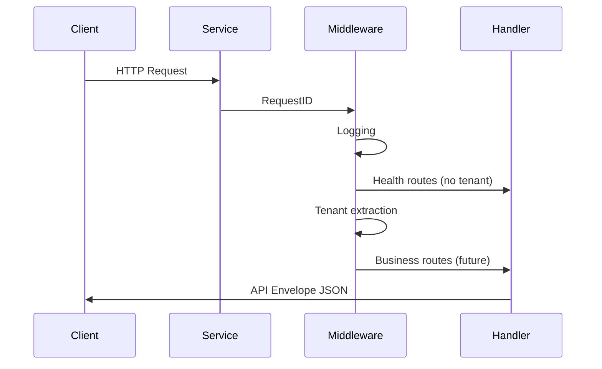

# GoApps Platform Architecture

## Overview

GoApps Platform is a cloud-native low-code platform built as a monorepo. The foundation phase establishes shared contracts, service boundaries, and infrastructure — without business logic or UI implementation.

## Monorepo Layout

```
platform/
├── apps/           Frontend shells (studio, runtime)
├── services/       Go microservices (Fiber)
├── packages/       Shared libraries (Go + TypeScript)
├── infrastructure/ Docker, Kubernetes, scripts
└── docs/           Documentation
```

## Service Boundaries

| Service | Responsibility |
|---------|----------------|
| auth | Authentication and authorization (Keycloak integration) |
| metadata | App definitions, schemas, platform metadata |
| runtime | Published app execution |
| connector | External system integrations |
| publish | App publishing and versioning |
| environment | Environment config and secrets references |
| audit | Audit trail recording |
| search | Search indexing and queries |

Each service is an independent Go module with its own deployment unit, health endpoints, and configuration.

## Shared Contracts

### API Response Envelope

All services return a consistent JSON envelope:

```json
{
  "success": true,
  "data": {},
  "error": { "code": "ERROR_CODE", "message": "Human-readable message" },
  "meta": { "requestId": "uuid", "timestamp": "ISO-8601" }
}
```

Implemented in:
- Go: `packages/shared/go/response`
- TypeScript: `packages/shared/src/api/response.ts`

### Tenant Context

Multi-tenancy is propagated via request headers (foundation phase) and JWT claims (future):

| Header | Field |
|--------|-------|
| `X-Tenant-ID` | Tenant identifier |
| `X-User-ID` | Authenticated user |
| `X-Organization-ID` | Organization scope |
| `X-Request-ID` | Correlation ID |

Tenant IDs are **never hardcoded** in application code. They are extracted at runtime from incoming requests.

Implemented in:
- Go: `packages/shared/go/tenant`, `packages/shared/go/middleware`
- TypeScript: `packages/shared/src/tenant/context.ts`

### Logging and Errors

- Structured logging via `log/slog` (JSON in production, text in development)
- Typed `AppError` with HTTP status codes and machine-readable error codes
- Global Fiber error handler maps errors to the standard response envelope

## Request Flow



## Infrastructure

Local development uses Docker Compose for PostgreSQL, Redis, MinIO, and Keycloak. Production deployment uses Kubernetes manifests under `infrastructure/kubernetes/`.

## Deferred (Future Phases)

- Business API endpoints
- Konva canvas and Monaco editor UI
- Database migrations and ORM layers
- Keycloak JWT validation in middleware
- API gateway and service mesh
