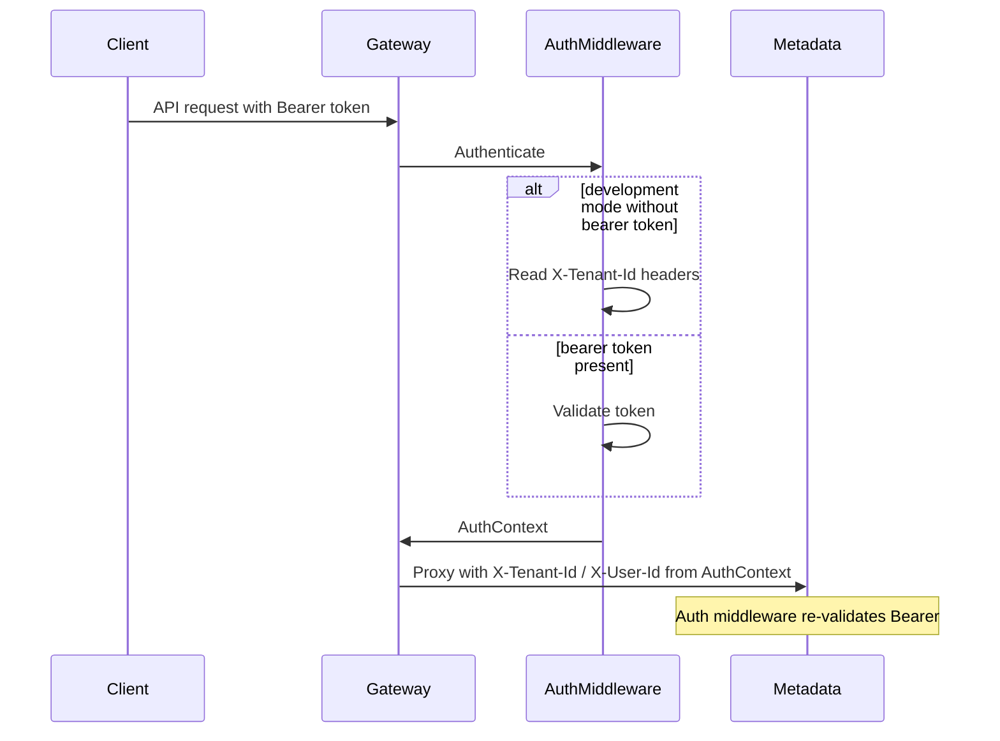

# Authentication

GoApps authenticates at the **gateway** and again on backend services (defense in depth). Studio and Runtime Vite proxies target the gateway (`:8090`). Studio stores session in `goapps.auth.session`; Runtime uses `goapps.runtime.auth.session` (same shape, separate key so the two apps do not collide).

## Flow



## AuthContext

Every authenticated request exposes:

| Field | Description |
|-------|-------------|
| `UserID` | Authenticated user UUID |
| `TenantID` | Tenant UUID |
| `Email` | User email |
| `Roles` | Role names |
| `IsAuthenticated` | Whether the request is authenticated |

Handlers must read tenant identity from `AuthContext` (via `GetFiberAuthContext`) when present. Gateway injects `X-Tenant-Id` / `X-User-Id` for upstream hops; in `AUTH_MODE=keycloak`, requests without a valid Bearer cannot spoof tenant by setting those headers alone.

## Development mode

Set on **gateway, metadata, publish, and runtime**:

```env
AUTH_MODE=development
```

Studio/Runtime:

```env
VITE_AUTH_MODE=development
```

Supported inputs:

1. **Header fallback**
   - `X-Tenant-Id` (required)
   - `X-User-Id` (optional)
   - `X-User-Email` (optional)

2. **Development bearer token**
   - `Authorization: Bearer dev:<tenant_uuid>:<user_uuid>[:email]`

Direct calls to `:8082` / `:8085` / `:8083` still work in development (validators). Studio should use the gateway proxy in normal use.

## Production mode (Keycloak)

```env
AUTH_MODE=keycloak
KEYCLOAK_URL=http://localhost:8080
KEYCLOAK_REALM=goapps
KEYCLOAK_CLIENT_ID=goapps-platform
KEYCLOAK_AUDIENCE=goapps-platform
```

Studio/Runtime:

```env
VITE_AUTH_MODE=keycloak
VITE_KEYCLOAK_URL=http://localhost:8080
VITE_KEYCLOAK_REALM=goapps
VITE_KEYCLOAK_CLIENT_ID=goapps-platform
```

`KeycloakTokenValidator` fetches JWKS from `{KEYCLOAK_URL}/realms/{REALM}/protocol/openid-connect/certs` and maps:

| Claim | AuthContext field |
|-------|-------------------|
| `sub` | `UserID` (UUID) |
| `tenant_id` / `goapps_tenant_id` / `organization.id` | `TenantID` |
| `email` / `preferred_username` | `Email` |
| `realm_access.roles` + client roles | `Roles` |

### Realm import (local Docker)

Realm file: [`infrastructure/docker/keycloak/realm-export.json`](../infrastructure/docker/keycloak/realm-export.json)

- Public client `goapps-platform` with PKCE (`S256`)
- Hardcoded `tenant_id` claim = demo tenant `00000000-0000-4000-8000-000000000001`
- Redirect URIs for Studio (`:5173`) and Runtime (`:5174`)

**Re-import after changing the export** (Keycloak only imports on first create):

```bash
docker compose -f infrastructure/docker/docker-compose.yml stop keycloak
docker compose -f infrastructure/docker/docker-compose.yml rm -f keycloak
# Optional: drop Keycloak DB volume if the realm already exists
docker compose -f infrastructure/docker/docker-compose.yml up -d keycloak
```

Ensure Keycloak is started with `--import-realm` (see docker-compose command).

Studio login: authorization-code + PKCE at `/studio/login`.

Runtime login (Phase 7.7): same PKCE flow at `http://localhost:5174/login`.
Unauthenticated visits to `/apps/*` redirect to `/login?returnTo=…`. With
`VITE_AUTH_MODE=development`, the login page offers **Continue as developer**.
With `VITE_AUTH_MODE=keycloak`, Keycloak sign-in is required. After auth,
Runtime fetches packages with `Authorization: Bearer` (and optional
`?environmentId=` — see [enterprise-alm.md](enterprise-alm.md)).

## Public routes

- `GET /health`
- `GET /ready`
- `GET /live`

## Helpers

Package: `packages/shared/go/auth`

- `GetAuthContext(ctx)` / `GetFiberAuthContext(c)`
- `RequireAuthenticated()` / `RequireRole(role)`
- `NewKeycloakTokenValidator` / `NewDevTokenValidator`
- `Middleware(cfg, validator)`
