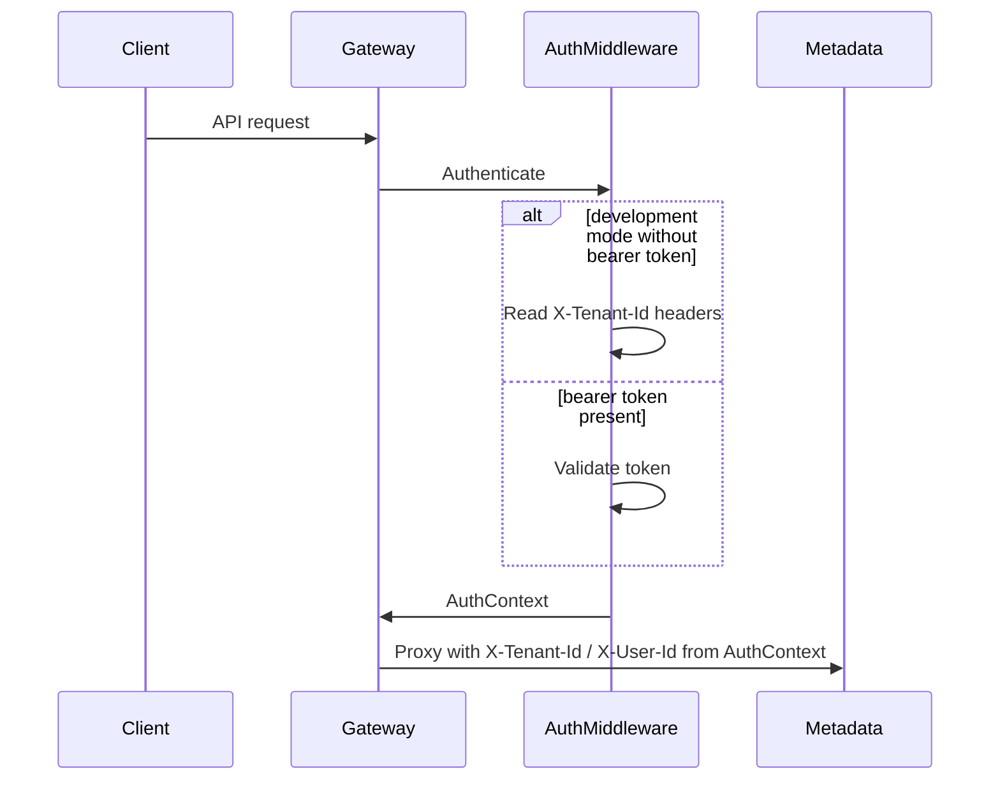

# Authentication

GoApps uses a gateway-level authentication layer that normalizes identity into `AuthContext` before proxying requests to backend services.

## Flow



## AuthContext

Every authenticated gateway request exposes:

| Field | Description |
|-------|-------------|
| `UserID` | Authenticated user UUID |
| `TenantID` | Tenant UUID |
| `Email` | User email |
| `Roles` | Role names |
| `IsAuthenticated` | Whether the request is authenticated |

Gateway handlers and proxy code must read tenant identity from `AuthContext` only. Upstream services continue to receive `X-Tenant-Id` and `X-User-Id` headers injected by the gateway.

## Development mode

Set:

```env
AUTH_MODE=development
```

Supported inputs:

1. **Header fallback (current workflow)**
   - `X-Tenant-Id` (required)
   - `X-User-Id` (optional, defaults to dev admin user)
   - `X-User-Email` (optional)

2. **Development bearer token**
   - `Authorization: Bearer dev:<tenant_uuid>:<user_uuid>[:email]`

Invalid bearer tokens return `401`.

## Production mode

Set:

```env
AUTH_MODE=keycloak
KEYCLOAK_URL=
KEYCLOAK_REALM=
KEYCLOAK_CLIENT_ID=
KEYCLOAK_AUDIENCE=
```

Keycloak validation is wired behind `TokenValidator` but not fully implemented yet. Enabling `AUTH_MODE=keycloak` will reject bearer tokens until JWKS validation is completed.

## Public routes

These gateway routes do not require authentication:

- `GET /health`
- `GET /ready`
- `GET /live`

## Helpers

Package: `packages/shared/go/auth`

- `GetAuthContext(ctx)`
- `GetFiberAuthContext(c)`
- `RequireAuthenticated()`
- `RequireRole(role)`

## Future Keycloak integration

`KeycloakTokenValidator` is a stub implementing `TokenValidator`. The planned implementation will:

1. Fetch JWKS from Keycloak
2. Validate JWT signature, issuer, audience, and expiry
3. Map realm/client roles into `AuthContext.Roles`
4. Enable production auth by configuration only (`AUTH_MODE=keycloak`)

No login UI is part of this phase.
