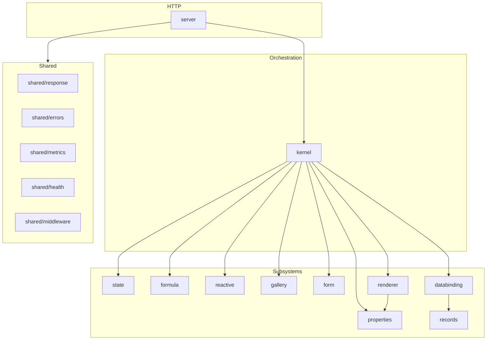

# Platform Hardening (Phase 6.9)

Production-readiness improvements for the runtime service before Connector Framework work. No end-user features were added.

## Dependency architecture

Runtime packages communicate through interfaces at the kernel boundary. The kernel is the sole orchestrator; leaf packages do not import each other (except `renderer → properties`).



No compile-time import cycles exist between runtime packages.

## API envelope

All endpoints return:

```json
{
  "success": true,
  "data": {},
  "error": null,
  "meta": {
    "requestId": "uuid",
    "timestamp": "ISO-8601",
    "pagination": { "limit": 50, "offset": 0, "total": 100 }
  }
}
```

Errors include `code`, `message`, optional `details`, and `correlationId`. Internal causes are never exposed for 5xx responses.

Standard codes: `BAD_REQUEST`, `VALIDATION_ERROR`, `UNAUTHORIZED`, `NOT_FOUND`, `VERSION_CONFLICT`, `SESSION_LIMIT`, `SERVICE_UNAVAILABLE`, `INTERNAL_ERROR`.

## Structured logging

Every completed request logs: `request_id`, `method`, `path`, `status`, `duration_ms`, and when available `session_id`, `screen_id`, `control_id`, `tenant_id`, `user_id`, `app_id`.

## Prometheus metrics

| Metric | Description |
|--------|-------------|
| `goapps_http_requests_total` | HTTP requests by method/path/status |
| `goapps_http_request_duration_seconds` | HTTP latency |
| `goapps_subsystem_operations_total` | Formula, property, renderer, records, session, reactive ops |
| `goapps_subsystem_duration_seconds` | Subsystem latency |
| `goapps_runtime_sessions_active` | Active session gauge |
| `goapps_runtime_metadata_cache_hits_total` | Metadata cache hits |
| `goapps_runtime_metadata_cache_misses_total` | Metadata cache misses |

## Session management

- TTL: `SESSION_TTL` (default 30m)
- Background cleanup: started automatically on server boot
- Max sessions: `SESSION_MAX` (optional cap)
- On expire: state, reactive, gallery, form, property, and renderer caches are cleared

## Metadata caching

`CachedMetadataLoader` wraps the Postgres loader with a short TTL cache (`METADATA_CACHE_TTL`) so multiple sessions for the same app do not repeat full metadata queries.

## Validation

One command validates the platform:

```bash
node infrastructure/scripts/validate-platform.mjs
```

Runs shared + runtime unit tests, integration tests (customer sample app), and optional live health/metrics checks when `:8083` is up.

## Related docs

- [Runtime kernel](runtime-kernel.md) — session lifecycle
- [Runtime renderer](runtime-renderer.md) — rendering pipeline
- [Architecture](architecture.md) — monorepo contracts
